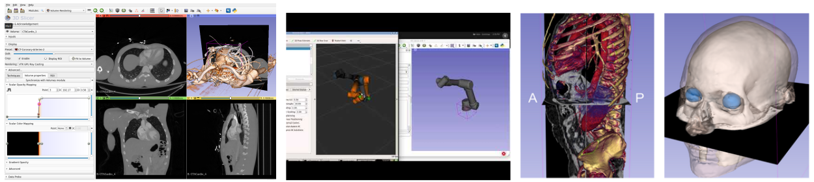

3D Slicer is an open source software platform for medical image analysis, 3D visualization and image-guided therapy used in clinical research worldwide. The application provides biomedical engineers and clinical researchers easy access to over 300 modules and extensions that can be run on their Windows, Mac and Linux laptop computer, with their own data. 3D Slicer provides functionalities for segmentation, registration, DICOM interoperability, automated measurements and 3D printing, as well as other utilities including virtual and augmented reality, tool tracking and real-time data fusion for image-guided therapy, and image annotation for deep learning. The software is built upon a set of robust and cross-platform open-source libraries, and enables the rapid development of biomedical image analysis tools. The goal of the workshop is to introduce the latest version of 3D Slicer to the Brazilian and Latin American biomedical engineering community. The sessions will provide an overview of the platform, and present examples of clinical research applications developed using the software. Topics will include brain mapping for neurosurgical intervention, robot-assisted applications, ultrasound-guided intervention, image processing for prostate cancer treatment, and the OpenIGTLink protocol for connecting 3D Slicer with devices in the operating room. Workshop participants will be guided through the resources and materials available, including download pages, tutorials and documentation, to discover the platform and join the global Slicer community.

## List of speakers
* Sonia Pujol (Brigham and Women’s Hospital and Harvard Medical School, USA)
* Pedro Moreira (Brigham and Women’s Hospital and Harvard Medical School, USA)
* Mariana Bernardes (Brigham and Women’s Hospital and Harvard Medical School, USA)
* Junichi Tokuda (Brigham and Women’s Hospital and Harvard Medical School, USA)
* Adriana H. Vilchis-González (Universidad Autónoma del Estado de México, Mexico)

## Agenda

* 9:00  Introduction and goals of the workshop
* 9:10  **Sonia Pujol** *"General Slicer introduction"*
* 9:40  **Junichi Tokuda** *"Slicer as a platform for image-guided therapy research"*
* 10:10 Break
* 10:30 **Pedro Moreira** *"Slicer interface with robots and MRI-guided procedures"*
* 11:00 **Mariana Bernardes** *"Slicer interface with robots and Ultrasound images"*
* 11:30 **Adriana Vilchis-González** *"3D Slicer in clinical practice: Level-1 hospitals"*
* 12:10 **Sonia Pujol** *"Slicer Internationalization"*
* 12:15 **Q&A session** [Questions accepted in English, Spanish, Portuguese or French] 

## References
- [3D Slicer](https://www.slicer.org/)
- [Robot Operating System](http://www.ros.org/)

## Acknowledgments
